# Fundsroom ERP — Database Schema & Entity-Relationship (ER) Diagram

> **System Source of Truth**: PostgreSQL 17 + Prisma ORM 5  
> **Schema File**: [`backend/prisma/schema.prisma`](../../backend/prisma/schema.prisma)

---

## 1. Entity-Relationship (ER) Diagram

This diagram strictly reflects the actual tables, fields, constraints, and relationships implemented in the PostgreSQL database via Prisma ORM.

```mermaid
erDiagram
    users ||--o{ enquiries : "creates (created_by_id)"
    users ||--o{ quotations : "creates (created_by_id)"
    users ||--o{ sales_orders : "confirms (confirmed_by_id)"
    users ||--o{ dispatches : "executes (dispatched_by_id)"
    users ||--o{ idempotency_keys : "scopes (userId)"

    customers ||--o{ enquiries : "places (customer_id)"
    customers ||--o{ quotations : "receives (customer_id)"
    customers ||--o{ sales_orders : "orders (customer_id)"

    products ||--|| inventories : "tracks (product_id)"
    products ||--o{ enquiry_items : "contained in (product_id)"
    products ||--o{ quotation_items : "contained in (product_id)"
    products ||--o{ sales_order_items : "contained in (product_id)"
    products ||--o{ dispatch_items : "contained in (product_id)"

    enquiries ||--o{ enquiry_items : "contains line items"
    enquiries ||--o{ quotations : "referenced by"

    quotations ||--o{ quotation_items : "contains line items"
    quotations ||--|| sales_orders : "converts to 1:1 (quotation_id)"

    sales_orders ||--o{ sales_order_items : "contains line items"
    sales_orders ||--|| dispatches : "fulfilled by 1:1 (sales_order_id)"

    dispatches ||--o{ dispatch_items : "contains line items"

    users {
        string id PK "UUID"
        string email UK "Unique email address"
        string password "bcrypt hash (10 rounds)"
        string fullName "Display name"
        enum role "ADMIN | SALES_USER"
        datetime createdAt "Audit timestamp"
        datetime updatedAt "Audit timestamp"
    }

    customers {
        string id PK "UUID"
        string company_name "Enterprise company name"
        string contact_person "Primary contact person"
        string mobile "Mobile contact number"
        string email "Business email"
        string city "Operating city"
        datetime created_at "Audit timestamp"
        datetime updated_at "Audit timestamp"
    }

    products {
        string id PK "UUID"
        string code UK "Unique product SKU code"
        string name "Descriptive product name"
        string category "Product classification"
        string unit "Unit of measure (PCS, MTR, etc.)"
        decimal base_price "Decimal(12,2) base catalog price"
        datetime created_at "Audit timestamp"
        datetime updated_at "Audit timestamp"
    }

    inventories {
        string id PK "UUID"
        string product_id FK,UK "1:1 link to products.id"
        int physical_quantity "Units physically in warehouse (>= 0)"
        int reserved_quantity "Units committed to confirmed orders (>= 0)"
        int damaged_quantity "Quarantined/unsellable units (>= 0)"
        datetime updated_at "Audit timestamp"
    }

    enquiries {
        string id PK "UUID"
        string enquiry_number UK "Sequential format: ENQ-YYYYMMDD-XXXX"
        string customer_id FK "References customers.id (Restrict)"
        datetime enquiry_date "Enquiry intake date"
        datetime required_date "Customer requested fulfillment date"
        string notes "Optional remarks or specifications"
        enum status "NEW | QUOTED | WON | LOST"
        string created_by_id FK "References users.id (Restrict)"
        datetime created_at "Audit timestamp"
        datetime updated_at "Audit timestamp"
    }

    enquiry_items {
        string id PK "UUID"
        string enquiry_id FK "References enquiries.id (Cascade)"
        string product_id FK "References products.id (Restrict)"
        int quantity "Requested quantity (> 0)"
        datetime created_at "Audit timestamp"
    }

    quotations {
        string id PK "UUID"
        string quotation_number UK "Sequential format: QTN-YYYYMMDD-XXXX"
        string enquiry_id FK "References enquiries.id (Restrict)"
        string customer_id FK "References customers.id (Restrict)"
        datetime valid_until "Quotation expiration timestamp"
        decimal subtotal "Decimal(12,2) sum of base amounts"
        decimal total_discount "Decimal(12,2) total discount amount"
        decimal total_gst "Decimal(12,2) total GST tax amount"
        decimal grand_total "Decimal(12,2) final payable amount"
        enum status "DRAFT | SENT | ACCEPTED | REJECTED"
        string created_by_id FK "References users.id (Restrict)"
        datetime created_at "Audit timestamp"
        datetime updated_at "Audit timestamp"
    }

    quotation_items {
        string id PK "UUID"
        string quotation_id FK "References quotations.id (Cascade)"
        string product_id FK "References products.id (Restrict)"
        int quantity "Quoted quantity (> 0)"
        decimal unit_price "Decimal(12,2) per-unit rate"
        decimal discount_pct "Decimal(5,2) line discount percentage"
        decimal gst_pct "Decimal(5,2) GST rate percentage"
        decimal base_amount "Decimal(12,2) quantity * unit_price"
        decimal discount_amount "Decimal(12,2) base_amount * discount_pct / 100"
        decimal net_amount "Decimal(12,2) base_amount - discount_amount"
        decimal gst_amount "Decimal(12,2) net_amount * gst_pct / 100"
        decimal line_amount "Decimal(12,2) net_amount + gst_amount"
        datetime created_at "Audit timestamp"
    }

    sales_orders {
        string id PK "UUID"
        string order_number UK "Sequential format: SO-YYYYMMDD-XXXX"
        string quotation_id FK,UK "1:1 link to quotations.id (Restrict)"
        string customer_id FK "References customers.id (Restrict)"
        datetime order_date "Order placement date"
        decimal total_amount "Decimal(12,2) total order amount"
        enum status "PENDING | CONFIRMED | DISPATCHED | CANCELLED"
        string confirmed_by_id FK "References users.id (SetNull)"
        datetime confirmed_at "Timestamp of Admin confirmation"
        datetime created_at "Audit timestamp"
        datetime updated_at "Audit timestamp"
    }

    sales_order_items {
        string id PK "UUID"
        string sales_order_id FK "References sales_orders.id (Cascade)"
        string product_id FK "References products.id (Restrict)"
        int quantity "Ordered quantity (> 0)"
        decimal unit_price "Decimal(12,2) contracted unit price"
        decimal line_amount "Decimal(12,2) total line valuation"
        datetime created_at "Audit timestamp"
    }

    dispatches {
        string id PK "UUID"
        string dispatch_number UK "Sequential format: DSP-YYYYMMDD-XXXX"
        string sales_order_id FK,UK "1:1 link to sales_orders.id (Restrict)"
        datetime dispatch_date "Date and time of fulfillment dispatch"
        string vehicle_number "Transport vehicle registration"
        string driver_name "Designated driver name"
        string dispatched_by_id FK "References users.id (Restrict)"
        datetime created_at "Audit timestamp"
    }

    dispatch_items {
        string id PK "UUID"
        string dispatch_id FK "References dispatches.id (Cascade)"
        string product_id FK "References products.id (Restrict)"
        int quantity "Dispatched quantity"
        datetime created_at "Audit timestamp"
    }

    document_sequences {
        string doc_type PK "Document prefix (ENQ, QTN, SO, DSP)"
        string date_key PK "Date bucket (YYYYMMDD)"
        int last_seq "Monotonically increasing sequence number"
    }

    idempotency_keys {
        string id PK "UUID"
        string key "Client-supplied idempotency key"
        string userId FK "References users.id (Restrict)"
        string method "HTTP verb (POST, etc.)"
        string path "Request path (/api/customers, etc.)"
        string payloadHash "SHA-256 canonical fingerprint"
        enum status "PROCESSING | COMPLETED | FAILED"
        int responseStatus "Stored HTTP response status code"
        string responseBody "Stored JSON response body"
        datetime createdAt "Timestamp created"
        datetime expiresAt "Expiration timestamp for TTL cleanup"
    }
```

---

## 2. Table Specifications & Constraints

### 2.1 Domain / Business Tables (12 Tables)

| # | Table Name | Prisma Model | Description | Key Constraints & Indexes |
|---|---|---|---|---|
| 1 | `users` | `User` | Internal system accounts | PK: `id` (UUID), UK: `email` |
| 2 | `customers` | `Customer` | Client organizations & primary contact information | PK: `id` (UUID) |
| 3 | `products` | `Product` | Industrial catalog SKUs & base price | PK: `id` (UUID), UK: `code` |
| 4 | `inventories` | `Inventory` | Physical, reserved, and damaged stock levels | PK: `id` (UUID), UK: `product_id`, CHECK: `physical_quantity >= 0`, `reserved_quantity >= 0`, `damaged_quantity >= 0`, `physical_quantity >= reserved_quantity` |
| 5 | `enquiries` | `Enquiry` | Inbound client inquiries for goods | PK: `id` (UUID), UK: `enquiry_number`, FKs: `customer_id`, `created_by_id` |
| 6 | `enquiry_items` | `EnquiryItem` | Line items associated with an enquiry | PK: `id` (UUID), FKs: `enquiry_id` (ON DELETE CASCADE), `product_id` |
| 7 | `quotations` | `Quotation` | Commercial quotes with discount, tax, and totals | PK: `id` (UUID), UK: `quotation_number`, FKs: `enquiry_id`, `customer_id`, `created_by_id` |
| 8 | `quotation_items` | `QuotationItem` | Pricing details and calculations per quoted product | PK: `id` (UUID), FKs: `quotation_id` (ON DELETE CASCADE), `product_id` |
| 9 | `sales_orders` | `SalesOrder` | Confirmed contractual orders converted from quotes | PK: `id` (UUID), UK: `order_number`, UK: `quotation_id` (1:1 conversion), FKs: `customer_id`, `confirmed_by_id` |
| 10 | `sales_order_items` | `SalesOrderItem` | Contracted line items under each sales order | PK: `id` (UUID), FKs: `sales_order_id` (ON DELETE CASCADE), `product_id` |
| 11 | `dispatches` | `Dispatch` | Logistical shipment and delivery tracking | PK: `id` (UUID), UK: `dispatch_number`, UK: `sales_order_id` (1:1 fulfillment), FK: `dispatched_by_id` |
| 12 | `dispatch_items` | `DispatchItem` | Physical quantities fulfilled in the dispatch | PK: `id` (UUID), FKs: `dispatch_id` (ON DELETE CASCADE), `product_id` |

### 2.2 Supporting Infrastructure Tables (2 Tables)

| # | Table Name | Prisma Model | Description | Key Constraints & Indexes |
|---|---|---|---|---|
| 13 | `document_sequences` | `DocumentSequence` | Atomic sequence counter for collision-proof document numbers | Composite PK: `(doc_type, date_key)` |
| 14 | `idempotency_keys` | `IdempotencyKey` | Durable idempotency store supporting safe client retries | PK: `id` (UUID), Composite UK: `(key, userId, method, path)`, Index: `expiresAt` |

---

## 3. Relational Integrity Highlights

1. **Zero JSON Workflow Blobs**: Every domain concept (items, prices, quantities, taxes, dispatches) is stored in first-class relational tables.
2. **1:1 Strict Commercial Gating**:
   - `sales_orders.quotation_id` is unique, guaranteeing that an accepted quotation can convert to exactly one sales order.
   - `dispatches.sales_order_id` is unique, enforcing the business rule that each sales order is fulfilled by exactly one complete dispatch.
3. **Pessimistic Locking Compatibility**:
   - Inventory rows are locked using `SELECT ... FOR UPDATE` ordered by `product_id ASC`, completely preventing race conditions, negative inventory, and deadlocks.
4. **Auditability**:
   - Full user tracking (`created_by_id`, `confirmed_by_id`, `dispatched_by_id`) with foreign key constraints.
